<div align="center">
  
</div>

<br>

## `./projects --featured`

### Meridian

> AI agent for PR intelligence — analyzes GitHub changes and routes relevant updates through Slack.

`Python` · `AI Agents` · `GitHub` · `Developer Tooling`
**↳ IN DEVELOPMENT**

---

### PRISM

> Smart inhaler acoustic pipeline for respiratory event detection and ML inference.

`Python` · `DSP` · `Machine Learning` · `Embedded Systems`
**↳ IN DEVELOPMENT**

---

### IntelliRepo

> Graph-aware code intelligence using ASTs, dependency graphs, embeddings and semantic retrieval.

`Python` · `FastAPI` · `Graphs` · `RAG`
**↳ IN DEVELOPMENT**

<br>

## `./research`

```text
STATUS            WORK
────────────────────────────────────────────────────────────
PUBLISHED         PINN Hybrid LSTM — Battery Degradation
IN PUBLICATION    Facial Emotion Recognition Framework
```

**PINN Hybrid LSTM**
Physics-informed modelling of lithium-ion battery degradation using the NASA Battery Cycling Dataset.

**Facial Emotion Recognition**
Deep-learning framework extending emotion recognition toward states such as frustration and confusion.

<br>

## `./archive --shipped`

```text
skill-exchange-2.0/      full-stack skill exchange platform
llm-powered-rag/         multi-source RAG + semantic retrieval
unix-style-shell/        processes · pipes · redirection · execution
```

<br>

## `systemctl status zta`

```text
● zero-trust-banking.service

  architecture    Zero Trust
  identity        Keycloak
  backend         FastAPI
  database        PostgreSQL

  status          AWAITING DEPLOYMENT
```

<br>

## `./stack`

`C / C++` · `Python` · `TypeScript` · `JavaScript`

`FastAPI` · `Node.js` · `React` · `MongoDB` · `PostgreSQL`

`Git` · `Docker` · `Linux`

<br>

## `./interests`

```text
backend engineering    distributed systems
AI / ML systems        operating systems
embedded systems
```

<br>

<br>

## `./open-source`

<div align="center">


</div>

<br>

<div align="center">

`praju120056@github:~$ exit`

<a href="https://www.linkedin.com/in/prajakth-n-kumar-0092902a6/">LinkedIn</a> ·
<a href="https://prajakth-portfolio.vercel.app/">Portfolio</a> ·
<a href="mailto:prajakth.kumar@gmail.com">Email</a>

</div>

<div align="center">

`praju120056@github:~$ exit`

<a href="https://www.linkedin.com/in/prajakth-n-kumar-0092902a6/">LinkedIn</a> ·
<a href="https://prajakth-portfolio.vercel.app/">Portfolio</a> ·
<a href="mailto:prajakth.kumar@gmail.com">Email</a>

</div>

</div>
